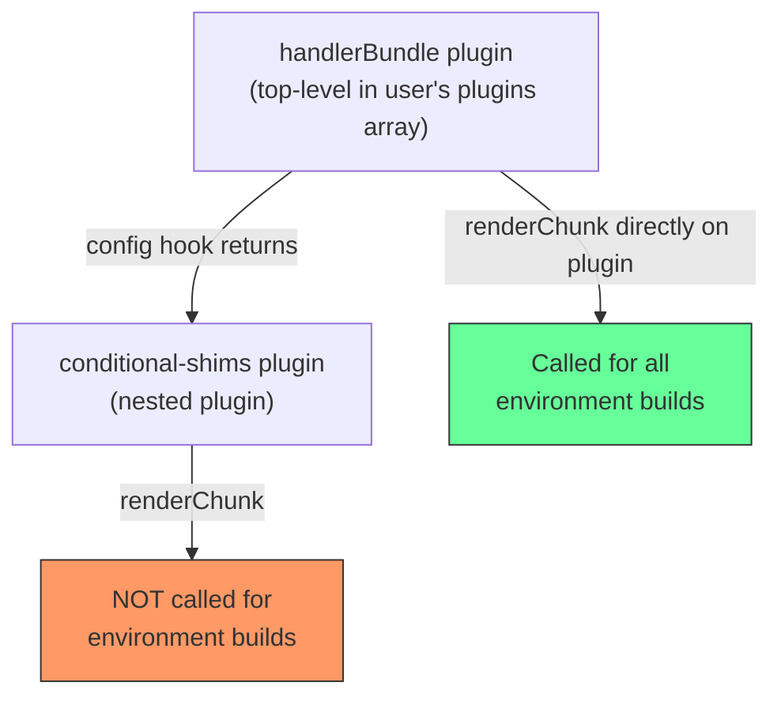

# PRD: Fix `renderChunk` hook in `@aligent/vite-plugin-handler`

## Problem

The `handlerBundle` plugin registers a `conditional-shims` plugin via the return value of its `config` hook. In Vite 8's Environment API, **build-phase hooks** (e.g. `renderChunk`) on plugins returned from `config` are not propagated to individual environment builds executed via `builder.buildApp`.

This means the conditional shims — which inject `node:http2` and `__dirname`/`__filename` polyfills into the bundled output — silently never fire. The bundled Lambda handlers end up with dangling `node_http2` references that crash at runtime with `node_http2 is not defined`.

## Root Cause



Vite's Environment API calls build-phase hooks (`renderChunk`, `generateBundle`, `writeBundle`, etc.) only on plugins registered directly in the top-level `plugins` array. Plugins nested inside a `config` hook's return value get their **config-phase hooks** (`config`, `configResolved`) invoked, but not their build-phase hooks.

## Fix

Move `renderChunk` from the nested `conditional-shims` plugin onto the `handler-bundle` plugin object itself. Resolve the `activeShims` list at plugin creation time (in the `handlerBundle` factory), not inside `config`.

### Before

```ts
export function handlerBundle(handlersPath, options) {
    return {
        name: 'handler-bundle',
        config(config) {
            return {
                plugins: [stripUnneededPlugins, createConditionalShims(options.shims)],
                //                              ^^^^^^^^^^^^^^^^^^^^^^^^^^^^^^^^^^^^^^^^
                //                              renderChunk on this nested plugin never fires
                environments,
                builder: { buildApp: ... },
            };
        },
    };
}
```

### After

```ts
export function handlerBundle(handlersPath, options) {
    const activeShims = resolveShims(options.shims);

    return {
        name: 'handler-bundle',
        config(config) {
            return {
                plugins: [stripUnneededPlugins],  // config-phase only — works fine nested
                environments,
                builder: { buildApp: ... },
            };
        },
        // Build-phase hook on the top-level plugin object — Vite invokes
        // this for every environment build
        renderChunk(code) {
            const matched = activeShims.filter(s =>
                s.needles.some(n => code.includes(n))
            );
            if (matched.length === 0) return null;
            return { code: `${matched.map(s => s.statement).join('\n')}\n${code}` };
        },
    };
}
```

### Why `stripUnneededPlugins` is unaffected

`stripUnneededPlugins` only uses `configResolved`, a config-phase hook. Config-phase hooks run once during config resolution before any environment builds, so they work correctly when returned from `config`.

## Scope

- **Package**: `@aligent/vite-plugin-handler`
- **Files changed**: `src/lib/handler-bundle.ts` (source), `src/lib/plugins.ts` (`createConditionalShims` can be removed or kept for backward compat)
- **Breaking changes**: None. The public API (`handlerBundle(path, options)`) and `options.shims` contract are unchanged.
- **Affected consumers**: Any service using `handlerBundle` with Vite 8+ that depends on `node_http2` or `__dirname`/`__filename` shims.

## Acceptance Criteria

1. Running `vite build` on a service that bundles AWS SDK (which references `node_http2`) produces output with `import * as node_http2 from 'node:http2';` prepended.
2. Running `vite build` on a service whose bundle references `__dirname`/`__filename` produces output with the ESM shim imports prepended.
3. Passing `shims: false` disables all shims (no banner injected).
4. Passing a custom `shims` array uses only the user-supplied shims.
5. No changes required in downstream `vite.config.mjs` files.
