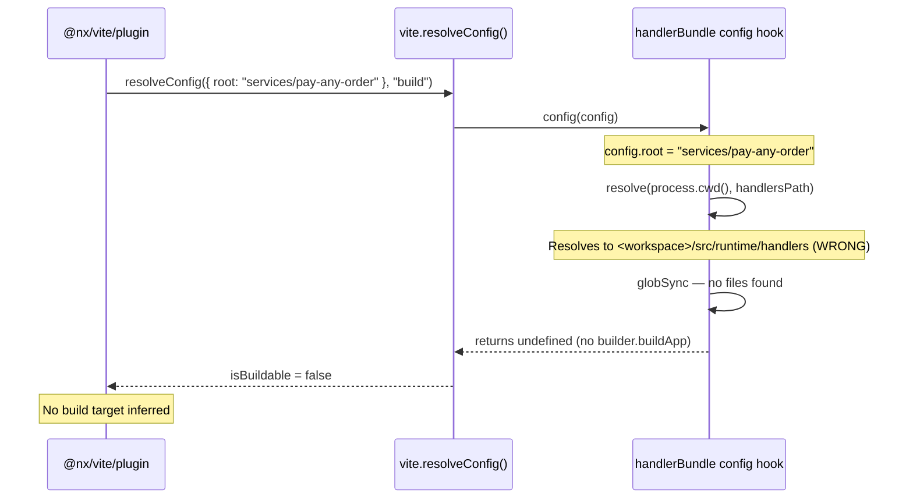

# Bug: `@nx/vite/plugin` does not infer `build` target for `handlerBundle` projects

**Package:** `@aligent/vite-plugin-handler@0.3.1`
**Repo:** <https://github.com/aligent/microservice-development-utilities> (`packages/vite-plugin-handler`)

## Problem

`@nx/vite/plugin` does not infer a `build` target for projects using `handlerBundle`. This means Nx does not know the project is buildable, so `dependsOn: ["^build"]` chains skip it and it cannot be built via `nx build`.

## Root cause

`@nx/vite/plugin` determines buildability by calling `vite.resolveConfig()` and checking for one of:

```js
// node_modules/@nx/vite/src/plugins/plugin.js — getOutputs()
const isBuildable = Boolean(
    build?.lib ||
    viteBuildConfig?.builder?.buildApp ||
    build?.rollupOptions?.input ||
    build?.rolldownOptions?.input ||
    existsSync(join(workspaceRoot, projectRoot, 'index.html'))
);
```

The `handlerBundle` plugin sets `builder.buildApp` in its `config` hook, which should satisfy the second condition. However, the handler directory is resolved with `process.cwd()`:

```js
// handler-bundle.ts — config hook
const handlersDir = resolve(process.cwd(), handlersPath);
```

During Nx project graph inference, `process.cwd()` is the **workspace root**, but `resolveConfig` is called with `root: '<projectRoot>'` (e.g. `services/pay-any-order`). The handlers path resolves to a non-existent directory under the workspace root, the plugin finds no handlers, and returns `undefined` — so `builder.buildApp` is never set.



## Fix

In `handler-bundle.ts`, use `config.root` (passed by Vite) instead of `process.cwd()`:

```diff
- config() {
+ config(config) {
      // ...
-     const handlersDir = resolve(process.cwd(), handlersPath);
+     const handlersDir = resolve(config.root || process.cwd(), handlersPath);
```

This ensures the handlers path resolves correctly both during normal `vite build` (where `cwd` is the project root) and during Nx inference (where `cwd` is the workspace root but `config.root` is set to the project root).

## Verification

After patching `node_modules/@aligent/vite-plugin-handler/src/lib/handler-bundle.js` locally:

```
$ node -e "resolveConfig({root:'services/pay-any-order'}, 'build') ..."
builder.buildApp? function    # was: undefined

$ npx nx show project @services/pay-any-order
build target: present          # was: missing
```
